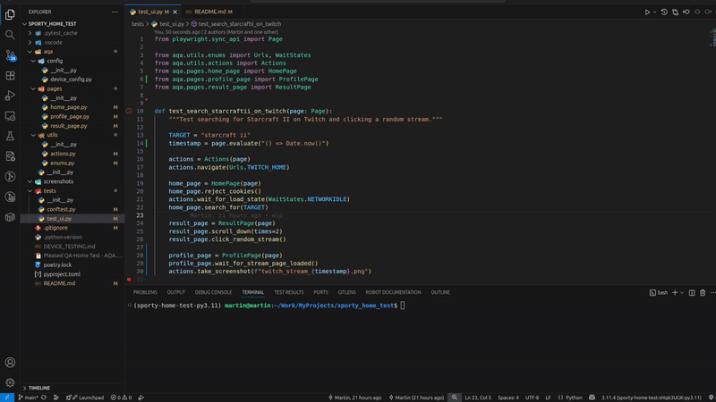

# Sporty Home Test: Web App Testing 

## 🎥 Demo



*Test execution showing Twitch search automation on Chrome mobile viewport*

## Overview
Project contains UI test, using Playwright Framework.
Main package is `aqa`, containing page objects, configuration, and utilities.
Tests are located in the `tests` directory, and are organized to allow running by device type and browser.

## Requirements
To be able to run test, ensure that you have the following:

- Python 3.11.4 or newer: Make sure you have Python installed on your system, recommended to use Pyenv for managing Python versions.
- Poetry: Use Poetry for packaging and dependency management. Refer to the Poetry documentation for installation instructions. Link -> `https://python-poetry.org/`

Clone the project: Clone the project repository and perform `poetry install` to install the required dependencies.

## Project Structure
├── tests/                   # Test cases
│   ├── test_demo.py     # Sample UI test using Playwright
├── aqa/                     # Automation framework code
│   ├── pages/               # Page Object Models
│   ├── config/              # Configuration files
│   └── utils/               # Utility functions and classes

## Running UI Tests
By default, tests run in headless mode (without browser UI). To run tests with a visible browser, set the `HEADLESS` environment variable to `false`. 

Example 
```bash
# Run all tests with browser UI
HEADLESS=false poetry run pytest tests/test_demo.py -v
```

### Run Defined Test from Instruction (Mobile and Google Chrome)
```bash
HEADLESS=false poetry run pytest tests/test_ui.py::test_search_starcraftii_on_twitch -v -s -k "chromium and mobile"
```

### Run All UI Tests
```bash
# Run all tests headless (no browser UI)
poetry run pytest tests/test_demo.py -v -s 
```

### Run Test/s by Browser
```bash
# Run all tests with a specific browser
poetry run pytest tests/test_demo.py -v -s -k <browser_name>
```

### Run Test/s by Device Type
```bash
# Run all tests with a specific device type
poetry run pytest tests/test_demo.py -v -s -k <device_type>
```

### Run a specific test with all browsers
```bash
poetry run pytest tests/test_demo.py::test_search_starcraft_on_twitch -v
```

## AI Assistance
This project uses GitHub Copilot to assist in code generation and suggestions. Copilot helps speed up development by providing context-aware code completions and suggestions. Project used GPT-4.1 model.